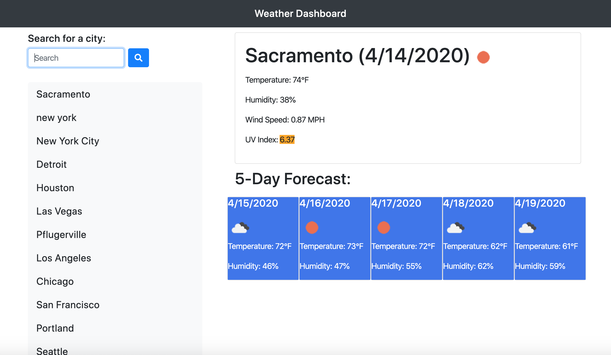

# Weather Dashboard

A weather application that displays the current weather and a 5-day forecast of any city that the user searches for. The user can then use this information to plan trips ahead of time depending on many factors.

# Description of Design

Using jQuery, CSS and HTML, I:

    1. Created the overall format of the page
    2. Utilized the Open Weather Map API
    3. Used AJAX to extract weather information for a city, whether the search term comes in the form of a button or search input
    4. Grabbed data from local storage to present the user with any previously searched cities as buttons to conveniently check weather for those cities
    5. Added event listeners for buttons, while taking into account event delegation to make sure each one functioned properly

Access the weather dashboard here: https://vxmao87.github.io/homework-6/

